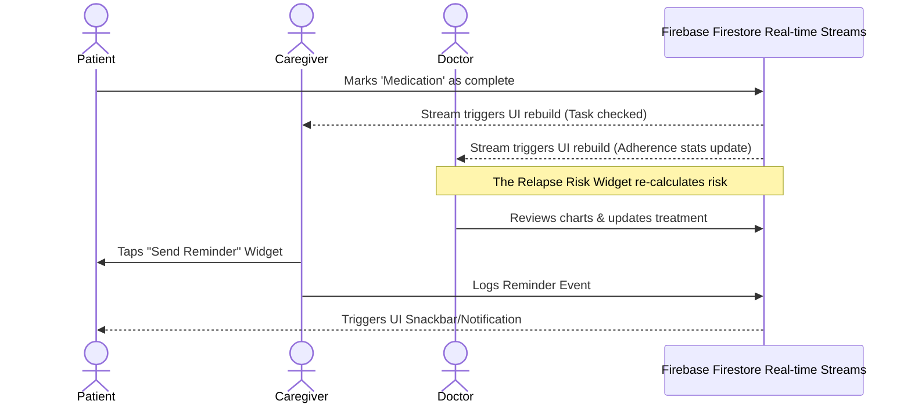

## 🔄 Workflow & Interaction

The interaction model resolves around asynchronous, event-driven updates.

### Component Breakdown
- **Login Component (`login_screen.dart`):** The application entry point ensuring role-based access. Once logged in, it establishes a persistent `StreamBuilder` connection.
- **Patient Workflow (`patient_dashboard.dart`):** Read-focused experience showing clearly demarcated tasks. Action interactions are simple toggles that update Firestore documents.
- **Caregiver Workflow (`caregiver_dashboard.dart`):** Observation-focused experience. Components interact with the `reminder_widgets.dart` to open a `ReminderDialog`, allowing the caregiver to broadcast targeted alerts for specific tasks.
- **Doctor Workflow (`doctor_dashboard.dart`):** Analytics-heavy experience. Composed of two primary sub-components:
  - **`recovery_graph_widget.dart`**: Interfaces with `fl_chart` to visually plot expected vs. actual recovery timelines.
  - **`relapse_risk_widget.dart`**: Consumes historical symptom/adherence data, applies rule-based conditional checks, and exposes actionable clinical insights.
